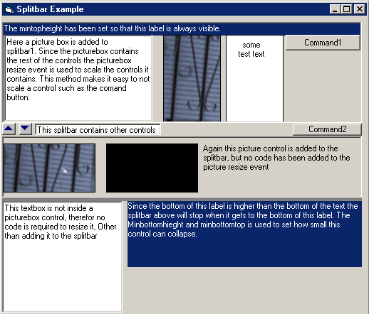

<div align="center">

## SplitBar


</div>

### Description

This control makes it very easy to add a horizontal split bar to your application.

Eventually this control will include vertical splitbars as well.

To use this control:

1. Place the control on a form.

2. Place controls above and below the splitbar control.

This control needs at least one control above it and one control

below it to function. The idea is that instead of using code to

set the maximum and minimum scrolling positions controls are used instead.

This makes it easy to visualize the range of motion for the control.

Also, you can reposition the controls in response to form resize events, and

the splitbar will use the new positions. Controls that are used only for

setting splitbar ranges can be hidden at run time.

In the future I will probaly change this so that the splitbar uses its current position

for the maximum top or maximum bottom position if no controls are added to the top or bottom.

3. In the form load event add references to the controls to the splitbar using the

AddControlTop and AddControlBottom events.

i.e.

splitbar1.AddControlTop Text1

splitbar1.AddControlBottom Text2

splitbar1.Update

Calling splitbar.Update will align the bottom of all TopControls controls with the top of the splitbar

and the tops of the BottomControls to the bottom of the splitbar.

Known bugs.

1. Currently the splitbar control brings itself to the top when a user moves it.

This was intended to make using the control easier, but it will hide any labels contained in

the control.

I think thats it, if you find more please let me know.

Also, please send me any ideas you may have to make this control better.
 
### More Info
 
At first I used API calls to move the splitbar and associated controls. Doing this I was able to make the window update nicely (no flashing) while the use dragged the splitbar. Unfortunatly if the border of the control was changed the control would disapear. So now it works like every other splitbar. If you have run in to this behavior, or know how to fix it please let me know.


<span>             |<span>
---                |---
**Submitted On**   |2001-12-10 14:16:56
**By**             |[RegX](https://github.com/Planet-Source-Code/PSCIndex/blob/master/ByAuthor/regx.md)
**Level**          |Intermediate
**User Rating**    |4.8 (19 globes from 4 users)
**Compatibility**  |VB 6\.0
**Category**       |[Custom Controls/ Forms/  Menus](https://github.com/Planet-Source-Code/PSCIndex/blob/master/ByCategory/custom-controls-forms-menus__1-4.md)
**World**          |[Visual Basic](https://github.com/Planet-Source-Code/PSCIndex/blob/master/ByWorld/visual-basic.md)
**Archive File**   |[SplitBar4093712102001\.zip](https://github.com/Planet-Source-Code/regx-splitbar__1-29648/archive/master.zip)

### API Declarations

```
Private Declare Function BringWindowToTop Lib "user32" (ByVal hwnd As Long) As Long
```


